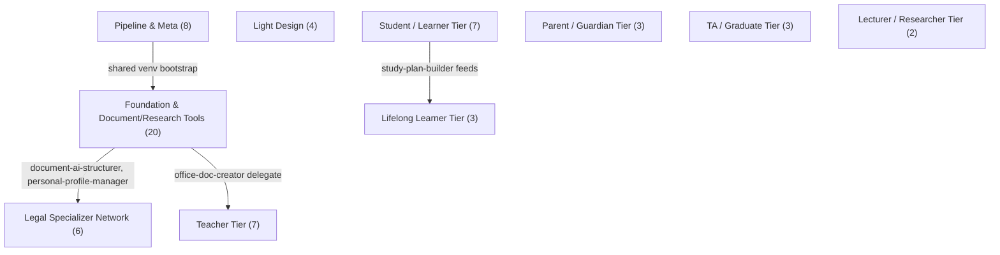
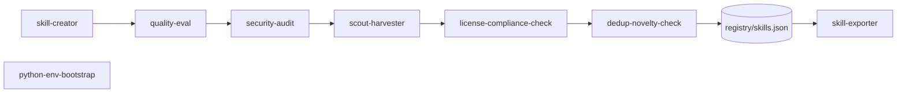
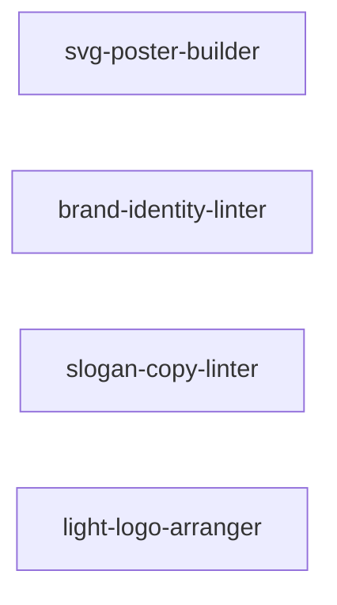
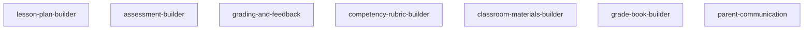
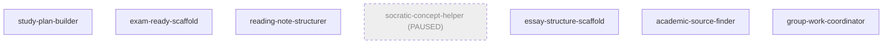
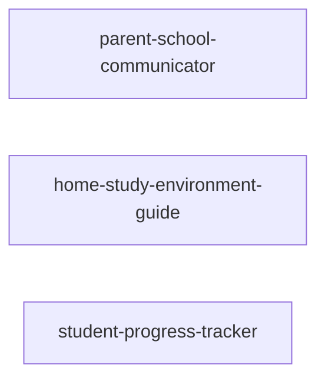
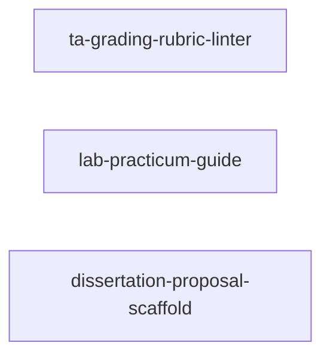
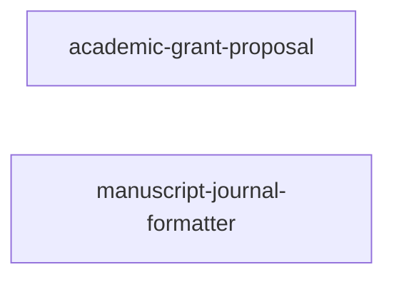
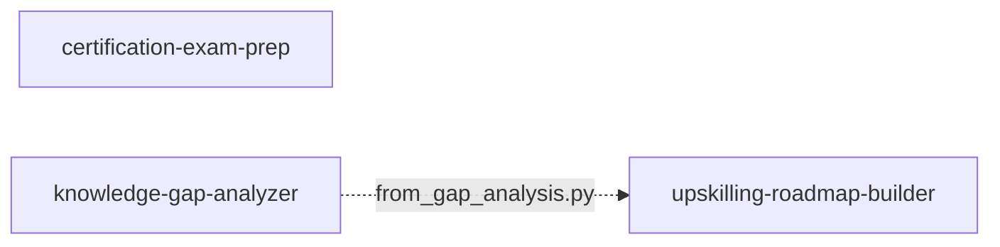

# Scriptorium — Skills Map

Generated from `registry/skills.json` (63 skills, 2026-08-01). Clusters follow the audience-tier/domain grouping documented in `docs/STATUS.md` and `docs/specs/STRATEGY_SPEC.md` §5 — not invented for this diagram. Regenerate by hand whenever the registry count changes; this file is a snapshot, not a source of truth (`registry/skills.json` always wins if they diverge).

Split into one diagram per layer instead of one giant flowchart — a single 62-node/10-subgraph graph doesn't render reliably in most Mermaid viewers. Each layer diagram below is self-contained (its own `skill-creator` note: linted independently). Edges that cross layers (e.g. `document-ai-structurer` feeding a Legal-tier skill) are listed as text under **Cross-layer dependencies**, not forced into a single-layer diagram.

## Layer 0 — Overview (10 clusters, 63 skills)

## Layer 1 — Pipeline & Meta (8)

The 9-step bootstrap pipeline (`CLAUDE.md`) plus the shared-venv dependency almost every scripted skill sits on.

## Layer 2 — Foundation & Document/Research Tools (20)

General-capability skills not tied to one audience: document structuring, citation/research discipline, document-generation engines.

## Layer 3 — Light Design (4)

Deterministic SVG/layout linting only — deliberately not expanded into general image generation or a Figma-class tool (`CLAUDE.md` scope discipline).

## Layer 4 — Legal Specializer Network (6)

The first niche-specializer network, all 6 elicited from a real junior-lawyer survey.

## Layer 5 — Teacher Tier (7)

## Layer 6 — Student / Learner Tier (7)

`group-work-coordinator` sits here for audience-tier placement but is tagged `domain: general` in the registry (deliberate exception, `docs/DECISIONS_PENDING.md` resolved item 7 — RACI matrices aren't education-specific).

## Layer 7 — Parent / Guardian Tier (3)

## Layer 8 — TA / Graduate Tier (3)

## Layer 9 — Lecturer / Researcher Tier (2)

## Layer 10 — Lifelong Learner Tier (3)

## Cross-layer dependencies

Real dependencies that cross a layer boundary — not drawable inside a single-layer diagram above, listed here instead of forced in:

| From (layer) | To (layer) | Relationship |
| --- | --- | --- |
| `python-env-bootstrap` (L1) | `document-ai-structurer`, `office-doc-creator`, `image-generator-gemini`, `browser-web-renderer`, `slide-deck-composer` (L2) | shared-venv bootstrap dependency (`registry/skills.json` `dependencies`) |
| `document-ai-structurer` (L2) | `legal-citation-checker`, `legal-form-filler` (L4) | registry `dependencies` field |
| `personal-profile-manager` (L2) | `legal-form-filler` (L4) | `autofill.py` output = `fill_form.py`'s `form_data.json` shape, documented chain |
| `office-doc-creator` (L2) | `assessment-builder` (L5) | DOCX render delegate |
| `study-plan-builder` (L6) | `upskilling-roadmap-builder` (L10) | registry `dependencies` field |

## Reading this map

- `socratic-concept-helper` (Layer 6) is drawn dashed/greyed — registered but `operational_status: paused`, excluded from `skill-exporter` bundles.
- `slide-deck-composer` (Layer 2, added 2026-08-01) is BYOT (Bring Your Own Template) — never bundles a template file itself; composes with `image-generator-gemini` (picture-placeholder fill) and `personal-profile-manager`'s `org_profile` (title-slide identity), documented within-layer, not drawn as an edge.
- Linted with `skills/mermaid-diagram-designer/scripts/lint_mermaid.py` (structural check only, not a real render) — each layer's fenced block extracted and linted independently.
