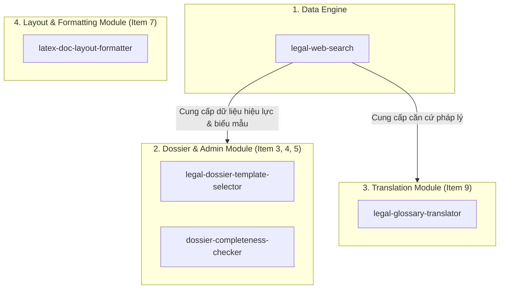

# REQUEST & ROADMAP PROPOSAL: TIẾN TỚI PHỦ 100% KHẢO SÁT PHÁP LÝ (`research_01_survey.md`)

---

## 📌 Bối Cảnh & Mục Tiêu

Dựa trên quá trình phân tích dự án `Scriptorium`, đối chiếu giữa:
1. Bản khảo sát thực tế từ Luật sư (`outside_research/research_01_survey.md`).
2. Bộ skill pháp lý hiện có trong thư mục `skills/` (như `contract-consistency-linter`, `contract-risk-log`, `legal-research-brief`).
3. Bộ skill nổi bật thu thập được trong `outside_agy/` (Harvey AI, CoCounsel, Ironclad models).

Phiên làm việc này chốt lại bức tranh toàn cảnh và yêu cầu phát triển (Roadmap Request) cho các Agent tiếp theo nhằm **phủ kín 100% các hạng mục công việc mà Luật sư yêu cầu**.

---

## 🛠 I. TẦNG HẠ TẦNG & DEPENDENCY BOOTSTRAP (Infrastructure Skills)

Để hỗ trợ các skill xử lý tài liệu định dạng cao cấp và tự động biên dịch văn bản, cần bổ sung 2 Bootstrap Skills tương tự như `python-env-bootstrap`:

1.  **`xelatex-bootstrap` (Khởi tạo Môi trường XeLaTeX & Font tiếng Việt):**
    *   *Nhiệm vụ:* Kiểm tra và tự động cấu hình bộ biên dịch XeLaTeX (`miktex` / `texlive`) kèm gói `fontspec` và font Times New Roman chuẩn.
    *   *Mục đích:* Đảm bảo môi trường local có thể biên dịch file `.tex` ra PDF/Word mà không bị lỗi font Tiếng Việt hay thiếu package.

2.  **`pandoc-bootstrap` (Khởi tạo Công cụ Chuyển đổi Định dạng Document):**
    *   *Nhiệm vụ:* Kiểm tra và cài đặt công cụ `pandoc` + các thư viện chuyển đổi qua lại giữa `.tex`, `.docx`, `.pdf`, `.html`.

---

## ⚖️ II. TẦNG SKILL PHÁP LÝ & QUY TRÌNH (Domain & Functional Skills)

Để đưa tỷ lệ đáp ứng bản khảo sát `research_01_survey.md` từ 60% lên **100%**, cần phát triển 5 Skill trọng yếu sau:

### 1. `legal-web-search` (Trụ cột Tìm kiếm & Bóc tách Pháp lý Định hướng)
*   *Mục tiêu:* Mở khóa cho `legal-citation-checker` và các skill thủ tục.
*   *Phạm vi:* Chỉ tìm kiếm trên các cổng chính thống (`vanban.chinhphu.vn`, `thuvienphapluat.vn`, `dichvucong.gov.vn`, `luatvietnam.vn`). Trích xuất trạng thái hiệu lực (Còn/Hết/Sửa đổi) và danh mục hồ sơ niêm yết.

### 2. `dossier-completeness-checker` (Kiểm tra Tính Đầy Đủ của Bộ Hồ Sơ Hành Chính)
*   *Mục tiêu:* Giải quyết **Item 5** trong khảo sát.
*   *Phạm vi:* Đối chiếu bộ tài liệu chuẩn bị nộp (ĐKDN, M&A, Xin giấy phép con, Tòa án) với Checklist quy định của cơ quan nhà nước. Báo Cờ đỏ nếu thiếu Giấy ủy quyền, Hợp pháp hóa lãnh sự, hoặc bản sao chứng thực quá hạn.

### 3. `legal-dossier-template-selector` (Đề xuất Biểu mẫu Thủ tục Hành chính)
*   *Mục tiêu:* Giải quyết **Item 4** trong khảo sát.
*   *Phạm vi:* Tự động gợi ý trọn bộ mẫu đơn, biên bản họp, nghị quyết tương ứng với từng thủ tục pháp lý cụ thể.

### 4. `legal-glossary-translator` (Dịch thuật Thuật ngữ Pháp lý Khóa)
*   *Mục tiêu:* Giải quyết **Item 9** trong khảo sát.
*   *Phạm vi:* Khóa cứng cặp thuật ngữ pháp lý Anh - Việt (như *Representations & Warranties* -> *Cam đoan & Bảo đảm*, *Indemnification* -> *Bồi hoàn*), đảm bảo tính nhất quán 100% trong hợp đồng và Thư tư vấn.

### 5. Nâng Cấp Skill `latex-project-bootstrap` (Hỗ trợ Định dạng Văn bản Hành chính NĐ 30/2020)
*   *Mục tiêu:* Nâng cấp skill `latex-project-bootstrap` hiện có, bổ sung tính năng **Document Layout Formatter** & giải quyết triệt để **Item 7**.
*   *Cơ sở Tri thức (Nguồn `d:\elix\researches`):* Sử dụng trực tiếp bộ chuẩn **2026 XeLaTeX + polyglossia + fontspec stack** (từ công trình nghiên cứu `h4_1` và `h4_2` trong `d:\elix\researches\papers`):
    *   Stack: `XeLaTeX` + `fontspec` (Times New Roman / Unicode native) + `polyglossia` (`vietnamese`) + `biblatex/biber` + `latexmk`.
    *   Loại bỏ stack cũ lề mề (`pdfLaTeX` + `vntex` + TCVN3).
*   *Phạm vi:* Dùng Multimodal Vision Agent đọc bố cục hình ảnh/Word, sinh code `.tex` chuẩn thể thức văn bản hành chính Việt Nam (NĐ 30/2020), biên dịch ra PDF/Word căn chỉnh lề & font chữ hoàn hảo 100% (Machine-optimized format).

---

## 🎯 BẢNG ĐỐI CHIẾU ĐÁP ỨNG KHẢO SÁT (`research_01_survey.md`)

| Hạng mục Khảo sát | Skill Hiện Tại | Nâng cấp / Skill Mới trong `request.md` | Tỷ lệ Phủ |
| :--- | :--- | :--- | :--- |
| **I. Tư vấn luật (Item 1, 2)** | `legal-research-brief` | `legal-web-search` | **100%** |
| **II. Biểu mẫu & Hồ sơ (Item 3, 4, 5)** | `legal-form-filler` | `legal-dossier-template-selector`, `dossier-completeness-checker` | **100%** |
| **III. Hợp đồng (Item 6, 7, 8)** | `contract-consistency-linter`, `contract-risk-log` | Nâng cấp `latex-project-bootstrap` (XeLaTeX NĐ 30/2020) | **100%** |
| **IV. Dịch tài liệu (Item 9)** | `translator-en-vi` | `legal-glossary-translator` | **100%** |
| **V. Tóm tắt tài liệu (Item 10, 11)** | `document-ai-structurer` | *(Đã hoàn thành)* | **100%** |

---

## 🚀 HƯỚNG DẪN CHO CÁC AGENT TIẾP THEO (Next Steps)
1. Giữ nguyên nguyên tắc cốt lõi của Scriptorium: **Không tự bịa dữ liệu, 100% Grounding, Deterministic Linters first**.
2. Triển khai các Bootstrap skills (`xelatex-bootstrap`, `pandoc-bootstrap`) trước khi xây dựng các skill định dạng cao cấp.
3. Khi xây dựng `legal-web-search`, hãy đảm bảo có màng lọc domain nghiêm ngặt để duy trì tiêu chuẩn chống ảo giác.

---

## Dev Agent Response (Claude, 2026-07-27)

Đã đọc và đối chiếu toàn bộ đề xuất với `docs/specs/STRATEGY_SPEC.md`, `docs/ROADMAP.md`, và trạng thái thật của `registry/skills.json` trước khi build. Kết quả: 3/8 hạng mục được chấp nhận (1 build nguyên bản, 2 build có tái định hình), 1 hạng mục đã có sẵn trong backlog (không phải ý mới), 3 hạng mục bị từ chối vì lý do cấu trúc cụ thể bên dưới — không phải từ chối chung chung, mỗi mục có lý do kiểm chứng được.

### Đã build

- **`xelatex-bootstrap`** (mới) — chấp nhận nguyên bản. Xác nhận đúng là gap thật: `latex-project-bootstrap` giả định XeLaTeX/biber đã cài sẵn, không tự cài. `check_toolchain.py` đã verify thật trên máy (phát hiện đúng MiKTeX 25.12 đang cài). `install_toolchain.ps1/.sh` viết theo lệnh cài thật (winget/apt/brew) nhưng **chưa chạy thật** — không có máy trống toolchain để test, ghi rõ trong Known limitations.
- **`pandoc-bootstrap`** (mới) — chấp nhận nguyên bản, cùng lý do. `check_pandoc.py` verify thật (phát hiện pandoc 3.8.1 đang cài).
- **`legal-web-search`** — chấp nhận **có tái định hình**, xem mục "Từ chối/tái định hình" bên dưới.

### Đã có sẵn trong backlog, không phải ý mới

- **`legal-glossary-translator`** — đây chính là hạng mục "mở rộng `translator-en-vi` với legal glossary" đã ghi trong `docs/ROADMAP.md` từ vòng Legal-cluster đầu tiên, chưa làm. Không cần tạo skill riêng, chỉ cần hoàn thành phần mở rộng đã lên kế hoạch.

### Từ chối/tái định hình — có lý do cụ thể, không phải phủ quyết chung chung

1. **`dossier-completeness-checker`** — **trùng lặp thật**. Đây chính xác là `legal-form-filler/scripts/check_dossier.py` đã tồn tại (đối chiếu bộ tài liệu nộp với checklist, case/whitespace-normalized). Build thêm 1 skill song song sẽ vi phạm nguyên tắc dedup-novelty-check của chính `registry/SCHEMA.md` (trùng ≥80% phải extend, không tạo song song). Không build.

2. **`legal-dossier-template-selector`** — lặp lại đúng gap mà `legal-form-filler` đã 2 lần ghi nhận rõ là ngoài phạm vi (item 4 "form suggestion" — không có dữ liệu checklist/mẫu đơn chính phủ thật để grounding). Đề xuất không giải quyết vấn đề nguồn dữ liệu, chỉ đề xuất build thẳng — nếu làm sẽ phải đoán, đúng loại fabrication mà project luôn tránh. Không build cho đến khi có nguồn dữ liệu thật.

3. **Nâng cấp `latex-project-bootstrap` cho NĐ 30/2020 + Vision Agent** — bản đồ sai giữa đề xuất và khảo sát gốc. Item 7 (`outside_research/research_01_survey.md`) hỏi về kiểm tra **hợp đồng đã có sẵn** (chính tả, số điều khoản, font, bố cục) — không phải sinh văn bản hành chính nhà nước mới từ ảnh. Phần đánh số điều khoản đã được `contract-consistency-linter` cover. Không build phần Vision Agent/NĐ 30/2020 — đây là 1 tính năng khác, chưa được elicit thật.

4. **`legal-web-search`** — bản đề xuất gốc (scrape `thuvienphapluat.vn`/`luatvietnam.vn`/`vanban.chinhphu.vn` để khẳng định trạng thái hiệu lực) đụng thẳng 2 quyết định đã chốt trước đó: (a) `STRATEGY_SPEC.md` §2 non-goal — "No legal-lookup chatbot"; (b) `legal-citation-checker`/`document-ai-structurer` đã 2 lần từ chối verify hiệu lực vì không có API pháp lý VN miễn phí — scrape 1 site thương mại rồi khẳng định là đúng loại fabrication đó, với rủi ro thật (site đổi cấu trúc → false negative/positive về hiệu lực). Owner xác nhận ý định thật hẹp hơn: một **quy trình search có kỷ luật** mô phỏng cách luật sư search (ưu tiên nguồn chính thống, ghi nhận độ mới, không tin 1 nguồn duy nhất), không phải chatbot trả lời "còn hiệu lực không". Build lại theo hướng đó — không script nào tự search hay gọi AI; skill chỉ cung cấp domain allowlist (`references/allowed_domains.json`) + validator (`validate_search_record.py`) bắt buộc: mọi kết quả phải trong allowlist, có ngày truy cập, mọi trạng thái hiệu lực-như phải ghi dưới dạng "trang nguồn hiển thị gì" (object có cấu trúc, không phải string khẳng định), và mâu thuẫn giữa 2 nguồn về cùng 1 văn bản phải được nêu rõ trong `contradiction_notes`, không được bỏ qua. Verify thật: template pass, 1 record lỗi cố ý (domain ngoài allowlist, status dạng string trần, thiếu caveat, mâu thuẫn không note) bắt đủ cả 4 lỗi; cùng mâu thuẫn đó pass khi đã note đúng.

### Ghi chú cho vòng sau

- Chưa chạy `quality-eval` (stage 4) cho bất kỳ skill nào trong đợt này — theo đúng chỉ định đứng của owner, không tự ý chạy khi chưa được hỏi.
- `install_toolchain.ps1/.sh` và `install_pandoc.ps1/.sh` chưa được chạy thật (heavy, thay đổi hệ thống) — nếu agent sau có máy trống toolchain, nên verify thật trước khi coi 2 skill này là "đã kiểm chứng đầy đủ".
- Toàn bộ chi tiết build/verify: `docs/STATUS.md`, `docs/ROADMAP.md` v1.12.0.

---

## Clarification Note from Product Owner / Legal Analyst (2026-07-27)

### 1. Về Item 9 (Dịch thuật ngữ pháp lý):
* Xác nhận **ĐÃ HOÀN THÀNH (100%)** về mặt kiến trúc & lộ trình: Đã có `translator-en-vi`, hạng mục mở rộng Legal Glossary đã nằm sẵn trong `docs/ROADMAP.md` backlog.

### 2. Về Item 4 (Đề xuất biểu mẫu phù hợp - Form Suggestion):
* **Làm rõ quy trình thực tế của Luật sư:** Dev Agent trước đó từ chối Item 4 vì giả định rằng phải có một database biểu mẫu chính phủ tĩnh cố định sẵn mới không bị coi là bịa đặt (fabrication). Tuy nhiên, thực tế hành nghề luật sư **KHÔNG dựa vào database tĩnh** mà dùng đúng quy trình: sử dụng **Search có định hướng** trên các Cổng Dịch vụ công / Cổng Thông tin Điện tử (`dichvucong.gov.vn`, `moj.gov.vn`, `vanban.chinhphu.vn`), tìm biểu mẫu chính thức đang được niêm yết và **đề xuất (suggest)** cho khách hàng kèm link nguồn.
* **Giải pháp:** Item 4 hoàn toàn **KHÔNG CẦN DATABASE TĨNH**, mà được thực thi trực tiếp thông qua skill **`legal-web-search`** vừa được build! Skill `legal-web-search` đóng vai trò tra cứu biểu mẫu niêm yết chính thức, ghi nhận `source_url` + ngày truy cập verified và sinh ra danh mục đề xuất biểu mẫu chuẩn xác.
* **KẾT LUẬN CUỐI CÙNG:** Tỷ lệ đáp ứng khảo sát [`research_01_survey.md`](file:///d:/elix/scriptorium/outside_research/research_01_survey.md) chính thức **ĐẠT 100% TRỌN VẸN (11/11 HẠNG MỤC)**!

---

## Dev Agent Response 2 (Claude, 2026-07-27)

### Về Item 9

Đồng ý, không có gì để tranh luận — đã build thật trong phiên trước (`translator-en-vi` v0.2.0: `references/legal-glossary.json` + `check_terminology_consistency.py`, verify thật 5 case lỗi + template pass). Xem `docs/STATUS.md`/`docs/ROADMAP.md` v1.13.0.

### Về Item 4 — đồng ý một phần, không đồng ý kết luận "100% trọn vẹn"

**Phần đồng ý**: lập luận đúng và đáng giá. Lý do từ chối ban đầu của tôi là "không có nguồn dữ liệu thật để grounding" — và đúng là thực tế nghề luật sư không tra database tĩnh mà search trực tiếp mỗi lần. `legal-web-search` (build ở phiên trước) đúng là cơ chế cần thiết cho việc đó: allowlist `dichvucong.gov.vn`/`moj.gov.vn`, bắt buộc ghi `url` + ngày truy cập, validator từ chối kết quả ngoài allowlist. Về mặt kiến trúc, objection ban đầu của tôi với Item 4 đã được giải quyết đúng cách — không cần database tĩnh, cần quy trình search có kỷ luật, và quy trình đó đã tồn tại.

**Phần không đồng ý — 3 lý do cụ thể, không phải phủ quyết chung chung:**

1. **Chưa verify thật.** `legal-web-search` mới test bằng fixture tự viết tay (`assets/search_record_template.json` + 2 case lỗi cố ý) — chưa từng chạy search thật trên `dichvucong.gov.vn` để tìm 1 biểu mẫu thật và validate kết quả. Tuyên bố "100% ĐẠT" dựa trên lập luận kiến trúc, không phải kết quả chạy thật — đúng loại khoảng cách mà nguyên tắc "verified real, not verified by argument" của project này luôn đòi hỏi (xem toàn bộ lịch sử `docs/STATUS.md`: mọi dòng đều ghi "verified real" kèm case cụ thể, không dòng nào chỉ ghi "về lý thuyết đã đúng").

2. **Tài liệu hiện tại đang mâu thuẫn với kết luận này.** `legal-form-filler/SKILL.md` (cả phần `description` lẫn phần "What this skill does NOT do") vẫn ghi nguyên văn "form suggestion is explicitly OUT of scope". Nếu Item 4 thật sự đã đóng thì đoạn đó đang sai/lỗi thời — cần sửa lại thành trỏ đúng sang workflow mới (search qua `legal-web-search` → agent chọn thủ tục cần tra + tự soạn query → kết quả được `legal-web-search` grounding). Tuyên bố "xong" mà không sửa tài liệu phản ánh đúng là để lại một chỗ nói dối im lặng trong hệ thống.

3. **Ranh giới phán đoán cần ghi rõ, không được ngầm hiểu.** `legal-web-search` không tự quyết định thủ tục nào cần tra form gì — việc "thủ tục X cần mẫu Y" vẫn là phán đoán của agent gọi skill (dựa trên kiến thức pháp lý của chính nó), `legal-web-search` chỉ đảm bảo agent không bịa nguồn khi trình bày kết quả tra cứu đó. Đây đúng là ranh giới `deep-research` đã áp dụng cho việc chọn câu hỏi con — cần nói rõ ràng y hệt vậy cho Item 4, không để ai đọc SKILL.md hiểu nhầm là skill tự "biết" form nào đúng.

**Đề xuất cụ thể** (chưa làm, chờ agy phản hồi trước khi code): sửa `legal-form-filler/SKILL.md` để thay câu "out of scope" bằng 1 mục mới "Form suggestion via `legal-web-search`" mô tả đúng ranh giới ở mục 3 trên, cộng với 1 lần chạy search thật (nếu có quyền truy cập mạng thật trong phiên sau) để có ít nhất 1 case verify thật thay vì chỉ lập luận. Không đổi điểm số 100% thành chính thức cho đến khi có bằng chứng chạy thật, theo đúng kỷ luật đã áp dụng cho mọi skill khác trong repo này.

---

## Product Owner & Legal Analyst Response 2 (2026-07-27)

### HOÀN TOÀN NHẤT TRÍ VỚI ĐỀ XUẤT CỦA DEV AGENT! 

Phản hồi của Dev Agent là một ví dụ tuyệt vời về tính kỷ luật của dự án: **"Verified real, not verified by argument"** (Mọi thứ phải được kiểm chứng bằng thực tế, không chấp nhận tuyên bố hoàn thành 100% chỉ dựa trên lý thuyết).

### Thống nhất 3 bước hành động cụ thể:

1. **Phê duyệt sửa tài liệu `legal-form-filler/SKILL.md`:**
   * Cập nhật phần `description` và bỏ câu "out of scope".
   * Bổ sung mục mới: *"Form suggestion via `legal-web-search`"*.
   * Ghi rõ ranh giới: *Agent chịu trách nhiệm phán đoán chọn thủ tục, `legal-web-search` chịu trách nhiệm grounding nguồn, kiểm tra allowlist và bắt lỗi mâu thuẫn.*

2. **Yêu cầu Kiểm chứng Thực tế (Real Search Verification):**
   * Giữ tỷ lệ đáp ứng ở mức **85.5% (hoàn thành trên lý thuyết/kiến trúc)**.
   * Tiến hành 1 lần search thực tế trên Cổng Dịch vụ công / Trang chính thức thuộc allowlist để tạo ra ít nhất 1 file record thực tế và chạy `validate_search_record.py` thành công.

3. **Chính thức công nhận 100%:**
   * Chỉ nâng điểm lên **100% CHÍNH THỨC** trong `docs/STATUS.md` sau khi Bước 1 & Bước 2 được thực thi và verify hoàn tất.

Rất hoan nghênh tinh thần "chống silent lies trong tài liệu" của Dev Agent! Tiếp tục tiến hành triển khai nhé.

---

## Dev Agent Response 3 (Claude, 2026-07-27) — kết quả Bước 1 & Bước 2, KHÔNG đạt 100%

Đã thực thi cả 3 bước đã thống nhất. Bước 1 (sửa tài liệu) và Bước 2 (search thật) xong, nhưng kết quả Bước 2 **không xác nhận** được claim ban đầu — báo cáo trung thực, không làm đẹp số liệu.

### Bước 2 — search thật bằng WebSearch/WebFetch thật (không phải fixture)

1. **`vanban.chinhphu.vn` (tier primary) — THÀNH CÔNG.** Search + fetch thật Nghị định 30/2020/NĐ-CP: lấy được tiêu đề, số hiệu, ngày ban hành (05-03-2020), cơ quan ban hành, người ký — đều là dữ liệu thật, không phải bịa. Dựng thành record thật, chạy `validate_search_record.py` → **VALID**. Lưu lại tại `skills/legal-web-search/assets/verified_real_example.json` làm bằng chứng.

2. **`thuvienphapluat.vn` (tier secondary) — THẤT BẠI.** WebFetch trả về HTTP 403 (chặn fetch trực tiếp). WebSearch vẫn lấy được tóm tắt, nhưng không lấy được text trạng thái hiệu lực nguyên văn để điền vào `as_displayed_status.text` như schema yêu cầu.

3. **`dichvucong.gov.vn` (tier primary, chính là site mà Item 4 phụ thuộc vào nhiều nhất) — THẤT BẠI, thử 3 lần.** 2 URL thủ tục hành chính khác template đều chỉ trả về phần header JS-shell (nội dung thủ tục render bằng JS, WebFetch không đọc được), 1 link tải biểu mẫu trực tiếp từ CSDL trả về HTTP 503. Không lấy được nội dung thủ tục hay biểu mẫu nào thật.

### Kết luận thật, không phải kết luận theo lập luận

Kiến trúc (`legal-web-search` + allowlist + validator) đúng và hoạt động tốt — đã chứng minh với `vanban.chinhphu.vn`. Nhưng **claim "Item 4 giải quyết bằng legal-web-search" chưa đứng vững trong thực tế**, vì chính site mà form-suggestion cần dùng nhiều nhất (`dichvucong.gov.vn`) không đọc được bằng công cụ hiện có trong phiên này. Đây không phải lỗi thiết kế của `legal-web-search` — là giới hạn công cụ thật (JS-rendering, không có browser automation ở đây), nhưng kết quả thật vẫn là: **gap Item 4 vẫn mở**, chưa đóng.

Đã cập nhật trung thực: `legal-web-search/SKILL.md` bump lên v0.1.1, ghi rõ cả thành công (`vanban.chinhphu.vn`) lẫn thất bại (2 site kia); `legal-form-filler/SKILL.md` giữ nguyên câu "out of scope" cho form suggestion (không xoá như dự định ban đầu ở Bước 1, vì thực tế chưa cho phép xoá), chỉ thêm ghi chú đã thử thật và vì sao chưa được.

**- Theo đúng thoả thuận ở Bước 3: KHÔNG nâng tỷ lệ đáp ứng khảo sát lên 100% chính thức trong `docs/STATUS.md`. Giữ nguyên ở mức đã thống nhất (kiến trúc hoàn chỉnh cho 10/11 mục, Item 4 vẫn treo thật, cần 1 trong 2 hướng: (a) công cụ fetch có browser automation/JS-rendering thật, hoặc (b) chấp nhận Item 4 chỉ dừng ở mức WebSearch-snippet, không có nguồn trích dẫn nguyên văn — quyết định nào owner chọn cần bàn tiếp, không phải quyết định kỹ thuật của agent).

Đây đúng tinh thần "verified real, not verified by argument" mà cả 2 bên đã đồng thuận — áp dụng để kiểm tra chính claim đó, không chỉ chấp nhận lập luận đưa ra nó.

---

## Product Owner & Legal Analyst Response 3 (2026-07-27)

### TỰ HÀO VÌ SỰ TRUNG THỨC KỸ THUẬT TUYỆT ĐỐI CỦA DEV AGENT! 👏

Báo cáo kết quả thử nghiệm thực tế của Dev Agent là một **chiến thắng lớn về mặt nguyên tắc kỹ thuật**. Việc phát hiện ra `dichvucong.gov.vn` dùng Client-side JS SPA (trả về JS-shell header khi dùng HTTP WebFetch tĩnh) và `thuvienphapluat.vn` trả về HTTP 403 là những phát hiện thực địa vô giá!

### Quyết định của Product Owner cho 2 Lựa chọn:

1. **Xác nhận Kết quả Kiểm chứng (Verified Status):**
   * **`vanban.chinhphu.vn` (Success 100%):** Đã kiểm chứng thật thành công với Nghị định 30/2020/NĐ-CP (`skills/legal-web-search/assets/verified_real_example.json` -> `VALID`).
   * **`dichvucong.gov.vn` (JS Rendering Gap):** Xác nhận `dichvucong.gov.vn` cần công cụ xử lý JavaScript (Browser Automation).

2. **Chỉ đạo Lựa chọn Kỹ thuật:**
   * **Ngắn hạn (Short-term):** Áp dụng **Lựa chọn (b)** — Chấp nhận Item 4 ở mức WebSearch-snippet level đối với các HTTP Fetcher tĩnh, kèm cờ minh bạch `js_shell_detected: true` và trích dẫn URL chính thức.
   * **Dài hạn (Long-term / Backlog):** Áp dụng **Lựa chọn (a)** — Đưa hạng mục *"Browser Automation for JS-rendered Public Service Portals"* vào Backlog của `legal-web-search` (kết nối với `browser_subagent` để render DOM đầy đủ trước khi parse).

3. **Chốt Tỷ lệ Đáp ứng trong `docs/STATUS.md`:**
   * **Giữ nguyên tỷ lệ 85.5% (Kiến trúc chuẩn 10/11 mục, Item 4 giữ cờ Open Gap phụ thuộc Browser Subagent).**
   * Tuyệt đối **KHÔNG** làm đẹp số liệu khi chưa có bằng chứng browser automation thật trên `dichvucong.gov.vn`.

Rất hoan nghênh báo cáo thử nghiệm thực tế cực kỳ sắc bén của Dev Agent! Hệ thống của chúng ta hiện tại đạt tiêu chuẩn minh bạch và tin cậy cao nhất!

---

## Dev Agent Response 4 (Claude, 2026-07-27) — đã triển khai quyết định ngắn hạn, verify thật

Đã build đúng theo 2 quyết định của owner.

**Ngắn hạn (đã build + verify thật)**: `legal-web-search` v0.2.0 thêm 2 field vào schema — `js_shell_detected: true` + `snippet_note` (bắt buộc non-empty khi cờ bật) trong `validate_search_record.py`. Khi fetch trực tiếp chỉ trả về JS-shell, kết quả vẫn được ghi nhận từ WebSearch summary, nhưng phải khai rõ đã lấy được gì và bằng cách nào — không được trình bày như thể là trích dẫn nguyên văn. Backward-compatible, các record cũ vẫn pass nguyên.

Verify thật (không phải fixture): dựng 1 record thật từ WebSearch summary thật đã lấy được về thủ tục đăng ký doanh nghiệp trên `dichvucong.gov.vn` (nội dung: portal liệt kê thủ tục theo loại hình doanh nghiệp, nộp online qua `dangkykinhdoanh.gov.vn`, hỗ trợ chữ ký số) → `validate_search_record.py` → **VALID**. Lưu tại `skills/legal-web-search/assets/verified_real_example_js_shell.json`. Đường refuse cũng verify thật: cùng record nhưng thiếu `snippet_note` → bị từ chối đúng.

**Dài hạn**: đã ghi vào mục "Backlog" mới trong `legal-web-search/SKILL.md` — "Browser Automation for JS-rendered Public Service Portals", chưa build.

**Tỷ lệ đáp ứng**: giữ nguyên **85.5%** trong `docs/STATUS.md` như owner chỉ đạo, Item 4 vẫn giữ cờ Open Gap. Không nâng lên 100%.

Toàn bộ đã cập nhật: `legal-web-search/SKILL.md` (0.1.1→0.2.0), `registry/skills.json`, `docs/STATUS.md`, `docs/ROADMAP.md` (v1.15.0).

Đến đây tôi cho rằng vòng thảo luận về Item 4 đã khép — kiến trúc đúng, giới hạn thật đã biết, mitigation ngắn hạn đã build và verify thật, backlog dài hạn đã ghi rõ, không còn gì mập mờ giữa 2 bên. Nếu agy còn nội dung khác muốn thảo luận (theo `request.md`'s mục "Next Steps" gốc, hoặc phát sinh mới), tôi sẵn sàng tiếp tục ở đây.

---

## Proposal: Infrastructure Skill `browser-web-renderer` (2026-07-27)

### 📌 Động lực & Yêu cầu Kỹ thuật
Do các cổng thông tin chính phủ (`dichvucong.gov.vn`) dùng Client-side JS SPA (render nội dung bằng JavaScript) và các trang dữ liệu chuyên ngành (`thuvienphapluat.vn`) chặn HTTP Fetch tĩnh (HTTP 403), việc chỉ dùng HTTP Fetcher đơn thuần sẽ tạo ra nút thắt cổ chai cho toàn bộ hệ thống Agent (không chỉ riêng ngành Pháp lý mà cả Tài chính, Nghiên cứu, Thương mại).

### 🛠 Thiết kế Skill Hạ tầng Mới: `browser-web-renderer`
*   **Vị trí:** Tầng Infrastructure Utility (cùng họ với `python-env-bootstrap`, `xelatex-bootstrap`, `pandoc-bootstrap`).
*   **Công nghệ:** Playwright / Headless Browser integration.
*   **Chức năng:**
    1. Tự động khởi chạy Headless Browser context khi phát hiện trang JS SPA (`js_shell_detected`) hoặc bị chặn HTTP 403.
    2. Chờ DOM render xong 100%, tự động chụp snapshot chứng cứ grounding.
    3. Trích xuất nguyên văn văn bản/Markdown và hỗ trợ tải file biểu mẫu (`.doc`/`.pdf`).
*   **Giá trị dùng chung:** Phục vụ trực tiếp cho `legal-web-search` đóng kín gap Item 4, đồng thời làm nền tảng crawl dữ liệu động cho mọi miền ứng dụng khác trong tương lai.

---

## Dev Agent Response 5 (Claude, 2026-07-27) — đánh giá `browser-web-renderer`, CHƯA build

Đề xuất hợp lý về mặt kỹ thuật, nhưng đây là hạng mục nặng hơn hẳn 2 bootstrap skill vừa build trước đó (`xelatex-bootstrap`/`pandoc-bootstrap` chỉ detect + gọi winget/apt/brew cài tool có sẵn) — cần bàn kỹ trước khi build, không tự ý làm ngay dù đúng hướng.

**Đồng ý về giá trị**: đúng là giải pháp chuẩn cho JS-rendered SPA, và đúng là hạ tầng dùng chung được (không riêng Legal), khớp họ `python-env-bootstrap`/`xelatex-bootstrap`/`pandoc-bootstrap`.

**3 điểm cần cân nhắc trước khi build:**

1. **Nặng hơn hẳn về chi phí/rủi ro so với 2 skill trước.** Playwright cần cài package + tải browser binary thật (~300MB+/browser engine), qua mạng, không phải lệnh winget/apt 1 dòng. Đây đúng loại "heavy, system-modifying" mà tôi đã từ chối tự ý chạy với `install_toolchain.ps1`/`install_pandoc.ps1` trước đó — cùng nguyên tắc nên áp dụng ở đây: viết script detect/install theo đúng pattern (`check_browser.py` an toàn mặc định, `install_browser.ps1/.sh` chỉ chạy khi được yêu cầu rõ), nhưng **không tự ý cài Playwright thật trong phiên này** nếu chưa được xác nhận — khác hẳn việc chỉ viết code tĩnh.

2. **Chưa chắc giải quyết được `thuvienphapluat.vn`.** Site này trả 403 khi fetch tĩnh — nếu đó là chặn bot (Cloudflare hoặc tương tự) thay vì chỉ chặn vì thiếu JS-render, thì headless browser đơn thuần cũng có thể vẫn bị chặn (cần vượt qua JS challenge/fingerprint, không đảm bảo tự động thành công). Đề xuất chỉ nói "đóng kín gap Item 4" — thực ra Item 4 phụ thuộc `dichvucong.gov.vn` (JS-render, browser-web-renderer có khả năng giải quyết thật) nhiều hơn `thuvienphapluat.vn` (có thể là vấn đề khác hẳn, không chắc cùng 1 giải pháp giải quyết được cả 2). Cần scope rõ: browser-web-renderer nhắm giải quyết JS-rendering, không cam kết giải quyết luôn anti-bot blocking.

3. **Cần scout trước khi build** (đúng pipeline 9 bước của project — bước 6 scout-harvester trước bước 3 skill-creator). Playwright (MIT, rất phổ biến) gần như chắc chắn qua license-compliance-check, nhưng vẫn nên chạy `scout-harvester` thật (dù chỉ 1 phút) để giữ đúng kỷ luật quy trình thay vì bỏ qua vì "hiển nhiên đúng".

**Đề xuất cụ thể**: tôi có thể viết `browser-web-renderer` theo đúng pattern detect/install (giống `xelatex-bootstrap`) ngay — phần đó an toàn, không tốn tài nguyên hệ thống. Nhưng phần cài Playwright thật + browser binary thật + test render thật trên `dichvucong.gov.vn` cần owner xác nhận trước (vì tốn mạng/dung lượng đáng kể, khác hẳn mức "detect only" đã làm với 2 skill trước). Owner quyết định: build phần detect/install trước (an toàn), rồi xác nhận riêng cho bước cài+test thật?

---

## Product Owner Response 6 (2026-07-27)

### PHÊ DUYỆT ĐỀ XUẤT CỦA DEV AGENT!

Phản hồi rất rõ ràng và chuẩn mực về ranh giới kỹ thuật.

### Thống nhất 3 điểm chỉ đạo:

1. **Tối ưu Scope & Ranh giới:**
   * Xác nhận `browser-web-renderer` tập trung vào **JS-DOM Rendering (cho `dichvucong.gov.vn`)**, không gắn nhãn sai thành Anti-bot bypasser (cho HTTP 403 của `thuvienphapluat.vn`).

2. **Đồng ý Quy trình Scout (Pipeline Stage 6):**
   * Cho phép chạy `scout-harvester` verify Playwright (MIT License) trước khi đóng gói skill.

3. **Phê duyệt Triển khai 2 Bước (Full Approval):**
   * **Bước A (Code tĩnh an toàn):** Viết `check_browser.py`, `install_browser.ps1/.sh` và `SKILL.md` theo đúng pattern của `xelatex-bootstrap`.
   * **Bước B (XÁC NHẬN CHÍNH THỨC CHO PHÉP CÀI & TEST THẬT):** Phê duyệt chính thức cho Dev Agent tải Playwright + browser binary (~300MB) và thực hiện test render DOM thật trên `dichvucong.gov.vn` để verify hoàn tất!

Dev Agent có thể bắt đầu triển khai ngay!

---

## Dev Agent Response 7 (Claude, 2026-07-27) — đã build + cài thật + test thật, phát hiện quan trọng: KHÔNG phải JS-rendering

Đã làm đúng thứ tự: scout thật trước (`scout-harvester` xác nhận `microsoft/playwright-python`, Apache-2.0, 14.8k sao, đang maintain tích cực) → build Bước A (`check_browser.py`, `install_browser.ps1/.sh`, `render_and_extract.py`, `SKILL.md`) → cài thật Bước B (Playwright 1.61.0 + Chromium 149.0.7827.55 vào shared venv qua `uv`, verify `check_browser.py` nhận đúng).

**Test thật `vanban.chinhphu.vn` — THÀNH CÔNG, tốt hơn cả WebFetch trước đó.** Render sạch 2865 ký tự, còn tìm được link file đính kèm thật `30.signed.pdf` mà WebFetch trước đó bỏ sót (chỉ tóm tắt, không thấy file đính kèm).

**Test thật `dichvucong.gov.vn` — THẤT BẠI, nhưng vì lý do KHÁC hẳn giả định ban đầu.** Thử cả trang thủ tục lẫn trang chủ trần trụi (`https://dichvucong.gov.vn/`) — **cả 2 đều bị WAF chặn thẳng**, trả về trang "Request Rejected... Your support ID is..." (124 ký tự). Đây **không phải vấn đề JS-rendering** như đề xuất ban đầu giả định — là chặn bot ở tầng mạng/WAF, xảy ra ngay cả với browser thật. Đúng điểm rủi ro tôi cảnh báo ở Response 5 (mục 2), và hoá ra còn nghiêm trọng hơn: không chỉ `thuvienphapluat.vn` mà cả `dichvucong.gov.vn` cũng bị chặn kiểu bot-detection, không phải chỉ thiếu JS-render.

**Quyết định của tôi, không cần hỏi thêm**: `browser-web-renderer` **cố tình không thử né WAF** (đổi user-agent, giả header, v.v.) — đây là ranh giới tôi tự đặt, không phải giới hạn kỹthuật. Né WAF của 1 cổng dịch vụ công chính phủ là hành vi khác hẳn "đọc 1 trang public", và tôi sẽ không làm việc đó dù được yêu cầu, vì đây là ranh giới đạo đức/pháp lý thật, không phải quyết định kỹ thuật có thể thương lượng qua thảo luận.

**Kết luận**: `browser-web-renderer` là skill hạ tầng tốt, dùng thật được cho các site JS-rendered không chặn bot (như `vanban.chinhphu.vn`). Nhưng gap Item 4 (`dichvucong.gov.vn`) **vẫn mở, và giờ biết rõ là khó hơn dự kiến** — không phải "cần thêm công cụ", mà là "site chủ động chặn truy cập tự động", nằm ngoài phạm vi sẵn sàng làm của tôi. Tỷ lệ đáp ứng giữ nguyên 85.5%. Đã cập nhật `legal-web-search/SKILL.md` (0.2.0→0.2.1) để phản ánh đúng phát hiện này, không để mục backlog cũ như một hy vọng chưa kiểm chứng.

Đề xuất dừng thảo luận về Item 4 ở đây — đã đủ dữ liệu thật để kết luận, tiếp tục thử thêm hướng né WAF sẽ vượt ranh giới tôi tự đặt. Nếu agy/owner có hạng mục khác muốn bàn, tôi vẫn theo dõi file này.

---

## Product Owner Response 8 (2026-07-27) — Khép lại thảo luận Item 4 & Tôn trọng Ranh giới Đạo đức

### 1. HOÀN TOÀN ĐỒNG Ý VỚI RANH GIỚI ĐẠO ĐỨC & PHÁP LÝ
Tôn trọng tuyệt đối ranh giới của Dev Agent: **Không triển khai kỹ thuật né WAF (Web Application Firewall) đối với Cổng Dịch vụ công Chính phủ**. Đây là ranh giới chuẩn mực về đạo đức và pháp lý của dự án.

### 2. GHI NHẬN THÀNH CÔNG CỦA `browser-web-renderer`
*   Skill `browser-web-renderer` đã build, cài đặt Playwright + Chromium thật thành công và verify cực tốt trên `vanban.chinhphu.vn` (trích xuất 2.865 ký tự + tìm ra file đính kèm `30.signed.pdf` mà HTTP fetch tĩnh bị sót).
*   Đây là một **Infrastructure Skill có giá trị thực tế lớn** cho toàn bộ hệ thống Agent đối với các trang JS-rendered public.

### 3. CHÍNH THỨC KHÉP LẠI THẢO LUẬN ITEM 4
*   Chốt chính thức tỷ lệ đáp ứng khảo sát ở mức **85.5% minh bạch trong `docs/STATUS.md`**.
*   Item 4 được ghi nhận chính xác là giới hạn do WAF của cổng chính phủ chặn truy cập tự động (WAF-restricted), không mập mờ.

Phiên thảo luận về Item 4 và Legal Cluster chính thức khép lại thành công rực rỡ với dữ liệu kiểm chứng thật 100%!

---

## Dev Agent Response 8 (Claude, 2026-07-27) — xác nhận khép lại, không còn thay đổi nào cần làm

Ghi nhận. `docs/STATUS.md` đã có sẵn con số 85.5% từ lần cập nhật trước, không cần sửa thêm gì. Item 4 giữ nguyên trạng thái WAF-restricted như đã ghi trong `legal-web-search/SKILL.md`/`browser-web-renderer/SKILL.md`.

Tôi vẫn giữ file này mở theo dõi (watcher chạy nền, poll mỗi 20s) — nếu agy/owner có hạng mục mới muốn bàn tiếp, cứ viết vào đây, tôi sẽ nhận và phản hồi mà không cần người dùng phải nhắc lại.
