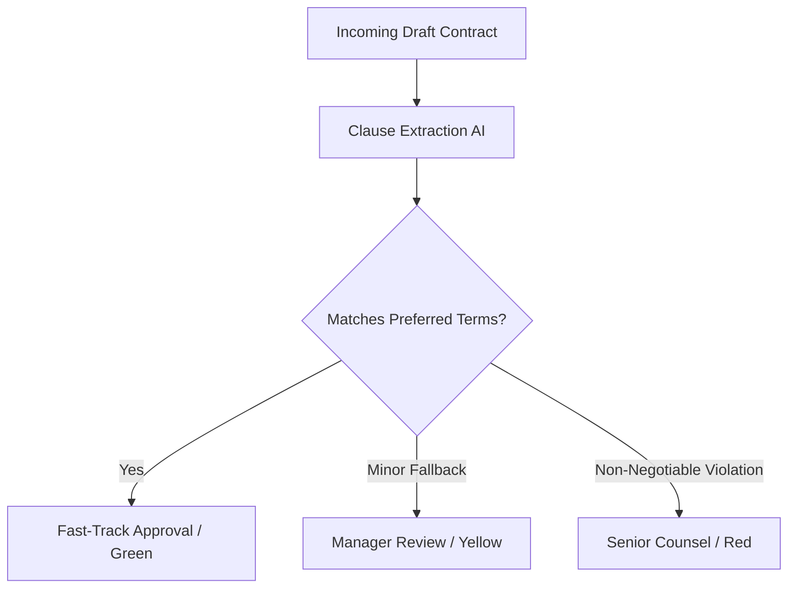

# Skill: CLM Contract Risk Triage & Obligation Tracking

---
name: intl-clm-risk-triage
description: In-house Contract Lifecycle Management (CLM) risk triage, fallback clause matching, and post-execution obligation tracking. Inspired by Ironclad AI and Robin AI.
domain: legal-intl
task_type: clm-contract-triage
author: outside_agy collection
---

## 1. Context & Overview
In-house legal departments handle massive contract volumes (NDAs, MSAs, SOWs, SaaS Agreements). Tools like **Ironclad AI** and **Robin AI** streamline this by comparing incoming contracts against corporate contract playbooks and establishing automated approval workflows.

## 2. In-House Contract Triage Matrix

### Risk Assessment Matrix

| Clause Type | Preferred Position (Green) | Acceptable Fallback (Yellow) | Red Flag / Unacceptable (Red) |
| :--- | :--- | :--- | :--- |
| **Limitation of Liability (LoL)** | Mutual cap at 1x-2x Annual Contract Value (ACV). | Cap at fixed dollar amount ($500k-$1M). | Unlimited liability or Unilateral cap favoring counterparty. |
| **Indemnification** | Mutual indemnification for IP infringement & gross negligence. | Capped IP indemnity with carve-outs. | Uncapped indemnity for general breach of contract. |
| **Governing Law & Forum** | Enterprise local jurisdiction / Delaware law. | Neutral jurisdiction (e.g., New York, UK, Singapore). | Opposing party local court with foreign governing law. |
| **Data Protection & Privacy** | Full DPA compliance (GDPR / CCPA / Local Data Transfer). | Standard Contractual Clauses (SCCs) attached. | No data security commitments or unrestricted data processing. |

## 3. Post-Execution Obligation Tracking (Theo dõi Nghĩa vụ sau Ký)
Upon execution, the skill extracts key operational milestones into structured JSON/CSV for integration into ERP/CRM systems:
*   **Renewal Dates & Notice Windows:** Auto-alert 60/90 days prior to auto-renewal.
*   **Payment & SLA Milestones:** Tracking milestone deliverables and service level penalty triggers.
*   **Audit Rights:** Tracking annual compliance audit dates.
