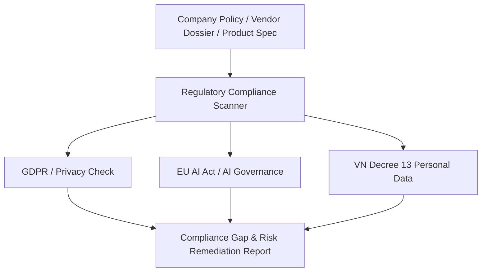

# Skill: International Regulatory Compliance & Privacy Audit

---
name: intl-compliance-audit-framework
description: Regulatory compliance auditing across multi-jurisdictional frameworks (GDPR, EU AI Act, ESG, Vietnam Decree 13/2023/ND-CP on Personal Data Protection). Inspired by Harvey AI Enterprise Compliance.
domain: legal-intl
task_type: compliance-audit
author: outside_agy collection
---

## 1. Context & Scope
Enterprise legal and compliance teams must audit products, vendor contracts, and operational policies against evolving regulatory frameworks. Inspired by platforms like **Harvey AI**, this skill automates compliance gap analysis.

## 2. Multi-Framework Audit Matrix



### Regulatory Compliance Checklist

| Regulatory Framework | Mandatory Requirement | Compliance Indicator | Risk Mitigation Action |
| :--- | :--- | :--- | :--- |
| **EU GDPR** | Cross-border data transfer mechanism (Art. 44-49). | Standard Contractual Clauses (SCCs) or Adequacy decision. | Execute SCCs with third-party vendors processing EU data. |
| **EU AI Act** | Risk classification & Transparency for High-Risk AI systems. | Technical documentation, Human oversight mechanism, Log retention. | Conduct Data Protection Impact Assessment (DPIA) & Fundamental Rights Impact Assessment. |
| **VN Decree 13/2023/ND-CP** | Consent of Data Subject & Impact Assessment Dossier (DPIA). | Explicit opt-in consent form, Dossier submitted to Department of Cybersecurity (A05). | Prepare Data Processing Impact Assessment within 60 days of processing. |
| **ESG / Supply Chain** | Corporate Sustainability Due Diligence (CSDDD). | Supplier Code of Conduct & Annual audit reports. | Audit Tier 1 suppliers for labor standards and environmental compliance. |

## 3. Compliance Gap Report Structure

```markdown
# REGULATORY COMPLIANCE AUDIT REPORT

### 1. Executive Summary
- Overall Compliance Score: [Compliant / Non-Compliant / Needs Remediation]
- High Priority Risks: [List of critical compliance breaches]

### 2. Detailed Gap Analysis Table

| Requirement ID | Framework & Section | Finding / Gap | Risk Level | Action Item |
| :--- | :--- | :--- | :--- | :--- |
| PRIV-01 | VN Decree 13 Art. 9 | Missing explicit consent clause for cross-border data transfer | High | Update Privacy Policy & Re-collect user consent |
| AI-02 | EU AI Act Art. 14 | Lack of human-in-the-loop override in automated scoring | Critical | Implement manual review gate before final decision |

### 3. Remediation Roadmap
- Phase 1 (Immediate - 30 Days): Critical legal non-compliance remediation.
- Phase 2 (Medium Term - 90 Days): Operational policy & contract updates.
```
