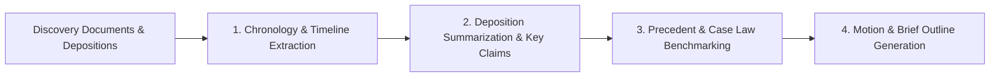

# Skill: International Litigation Discovery & Case Briefing

---
name: intl-litigation-brief-assistant
description: Phân tích hồ sơ tranh tụng, tóm tắt bản khai (deposition summaries), phân tích chứng cứ và lập dàn ý tranh tụng. Lấy cảm hứng từ CoCounsel (Thomson Reuters) & Casetext.
domain: legal-intl
task_type: litigation
author: outside_agy collection
---

## 1. Context & Inspiration
Modern litigation tools like **CoCounsel** leverage retrieval-augmented generation (RAG) over verified primary law and case databases. This skill encodes the workflow for handling litigation discovery, deposition analysis, and motion drafting.

## 2. Key Litigation Workflows

### Workflow 1: Deposition Summarization (Tóm tắt Bản khai Tranh tụng)
*   **Input:** Multi-page deposition transcripts.
*   **Processing Rules:**
    *   Extract key admissions, contradictions, and factual statements.
    *   Group by Topic (e.g., Knowledge of defect, Timeline of events, Communication with plaintiff).
    *   Include exact page and line references (e.g., `[Page 42, Lines 12-18]`).

### Workflow 2: Fact-to-Issue Mapping (Ánh xạ Chứng cứ với Yêu cầu Khởi kiện)

| Fact / Evidence Item | Source Document | Relevant Legal Issue / Claim | Impact on Case Strategy |
| :--- | :--- | :--- | :--- |
| Email dated Jan 15 showing notice of delay | Ex. A - Exhibit 104 | Breach of Notice Clause (Sec 8.1) | Supports Motion for Summary Judgment |
| Expert Testimony on causation | Deposition of Dr. Smith (P. 88) | Proximate Cause element | Weakness: Opposing counsel established lack of physical inspection |

### Workflow 3: Litigation Brief Outlining (Lập Dàn ý Tranh tụng)
*   **Statement of Issues:** Concise formulation of questions before the court.
*   **Statement of Facts:** Chronological, objective narrative citing record evidence.
*   **Argument Section:** Issue-by-issue legal analysis matching facts to statutory elements and controlling precedents.
*   **Conclusion & Prayer for Relief:** Specific remedies requested (dismissal, damages, injunctive relief).

## 3. Grounding & Verification Standard
*   **No Uncited Assertions:** Every factual assertion in the Statement of Facts must carry a transcript page/line or exhibit citation.
*   **Precedent Verification:** All cited case law must be checked for keycite/shepardize status (verifying the case remains good law and has not been overruled).
