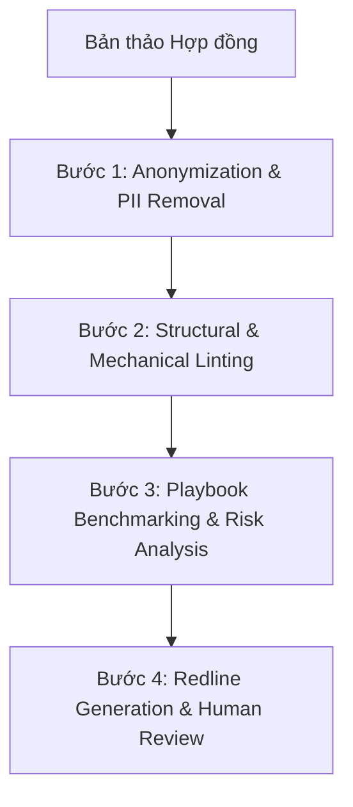

# Skill: VN Contract Review & Redlining Playbook

---
name: vn-contract-review-playbook
description: Rà soát hợp đồng thương mại, dịch vụ, mua bán hàng hóa và lao động theo quy định pháp luật Việt Nam. Tự động phân tích các điều khoản bất lợi, đề xuất phương án sửa đổi (redline) bám sát Playbook của doanh nghiệp/văn phòng luật, và đảm bảo tuân thủ bảo mật thông tin.
domain: legal-vn
task_type: contract-review
author: outside_agy collection
---

## 1. Mục tiêu & Phạm vi (Scope)
Skill này cung cấp quy trình 4 bước chuẩn hóa để rà soát hợp đồng tại Việt Nam, đối chiếu với Bộ luật Dân sự 2015, Luật Thương mại 2005, Luật Lao động 2019 và các văn bản hướng dẫn thi hành.

## 2. Quy trình Thực thi (Workflow)



### Bước 1: Anonymization & Security Guard
*   **Hành động:** Ẩn danh hóa các thông tin nhạy cảm trước khi đưa vào AI xử lý.
*   **Quy tắc:** Thay thế tên doanh nghiệp thành `[Bên A]`, `[Bên B]`, số tiền thành `[Giá trị hợp đồng]`, thông tin cá nhân thành `[Đại diện A]`.

### Bước 2: Kiểm tra Cơ học (Mechanical Checks)
*   **Đánh số Điều/Khoản:** Kiểm tra thứ tự logic (`Điều 1`, `Điều 2`...), không nhảy số.
*   **Trích dẫn nội bộ:** Kiểm tra các tham chiếu như *"theo quy định tại Điều X"* xem Điều X có tồn tại hay không.
*   **Danh xưng:** Kiểm tra việc dùng đồng nhất thuật ngữ (`Bên A`, `Bên B`).

### Bước 3: Đánh giá Rủi ro theo Playbook (Risk Evaluation)
Xác định và phân loại rủi ro theo bảng tiêu chuẩn:

| Hạng mục điều khoản | Tiêu chuẩn Playbook | Rủi ro cần cảnh báo | Căn cứ Pháp lý Việt Nam |
| :--- | :--- | :--- | :--- |
| **Phạt vi phạm & Bồi thường** | Mức phạt không quá 8% giá trị phần nghĩa vụ hợp đồng bị vi phạm (Thương mại). | Phạt > 8% hoặc phạt trên toàn bộ giá trị hợp đồng khi chỉ vi phạm một phần. | Điều 301 Luật Thương mại 2005; Điều 418 BLDS 2015. |
| **Đơn phương chấm dứt** | Báo trước tối thiểu 30 ngày, có căn cứ vi phạm nghiêm trọng. | Cho phép một bên chấm dứt tùy nghi không cần lý do và không bồi thường. | Điều 428 BLDS 2015. |
| **Giải quyết tranh chấp** | Tòa án có thẩm quyền tại nơi Bên bị kiện đặt trụ sở hoặc Trọng tài thương mại (VIAC). | Thẩm quyền Tòa án nước ngoài không có thỏa thuận tương trợ tư pháp hoặc quy định mập mờ. | Điều 39 Bộ luật Tố tụng Dân sự 2015. |
| **Bất khả kháng (Force Majeure)** | Phải thông báo trong vòng 7 ngày, kèm xác nhận của cơ quan có thẩm quyền. | Miễn trừ trách nhiệm kéo dài vô hạn không có nghĩa vụ khắc phục. | Điều 351 BLDS 2015. |

### Bước 4: Đề xuất Chỉnh sửa (Redline Prompt & Format)

```markdown
### BẢNG ĐỀ XUẤT REDLINE HỢP ĐỒNG

| Điều khoản gốc | Mức độ Rủi ro | Vấn đề Pháp lý / Bất lợi | Đề xuất Chỉnh sửa (Redline) | Căn cứ Luật |
| :--- | :--- | :--- | :--- | :--- |
| *[Điều 6.2]* | 🔴 Cao | Mức phạt vi phạm 15% vượt quá trần 8% quy định tại Luật Thương mại. | *"Mức phạt vi phạm là 8% giá trị phần nghĩa vụ bị vi phạm..."* | Điều 301 LTM 2005 |
```

## 3. Ranh giới An toàn & Cảnh báo (Safety Boundaries)
> [!CAUTION]
> AI **không được phép** khẳng định hợp đồng có hiệu lực pháp lý hay không. Quyết định phê duyệt cuối cùng và chữ ký redline thuộc về Luật sư chịu trách nhiệm chuyên môn.
