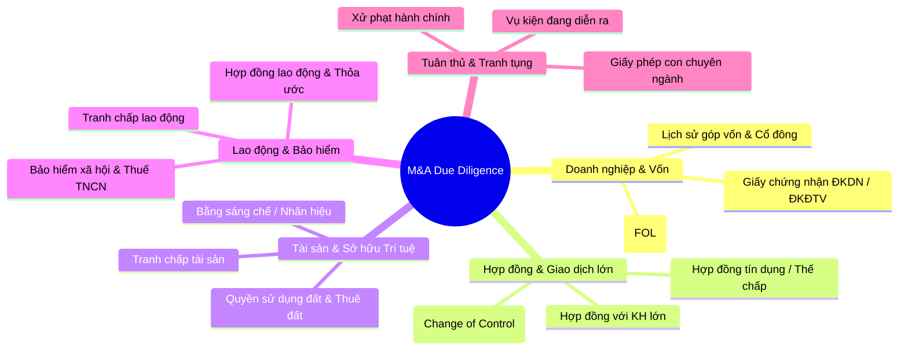

# Skill: VN M&A Legal Due Diligence & VDR Extraction

---
name: vn-mna-due-diligence
description: Thẩm định pháp lý M&A (Due Diligence) cho giao dịch mua bán doanh nghiệp, sáp nhập, chuyển nhượng cổ phần/vốn góp tại Việt Nam. Trích xuất tự động và phân loại rủi ro từ phòng dữ liệu ảo (Virtual Data Room - VDR).
domain: legal-vn
task_type: due-diligence
author: outside_agy collection
---

## 1. Mục tiêu & Phạm vi
Thẩm định toàn diện bức tranh pháp lý của Công ty Mục tiêu (Target Company) theo Luật Doanh nghiệp 2020, Luật Đầu tư 2020, Luật Lao động 2019 và các quy định ngành (Bất động sản, Fintech, Năng lượng...).

## 2. Các Trụ Cột Thẩm Định (5 Verification Pillars)

## 3. Quy trình Trích xuất VDR & Phát hiện Rủi ro

### Ma trận Trích xuất Dữ liệu (Extraction Matrix)

| Danh mục Hồ sơ | Thông tin cần Trích xuất | Cờ Rủi ro (Red Flag) |
| :--- | :--- | :--- |
| **Giấy phép Doanh nghiệp** | Mã số DN, Vốn điều lệ, Ngành nghề kinh doanh, Tỷ lệ vốn góp. | Nợ tiền góp vốn quá hạn 90 ngày; Ngành nghề điều kiện chưa đáp ứng FOL. |
| **Hợp đồng Tín dụng / Cho vay** | Dư nợ, Lãi suất, Tài sản thế chấp, Điều khoản Change of Control. | Hợp đồng quy định giao dịch M&A làm kích hoạt nghĩa vụ trả nợ trước hạn ngay lập tức. |
| **Hợp đồng Lao động** | Tổng số lao động, Loại HĐLĐ, Ban điều hành (C-Level). | Thiếu cam kết bảo mật (NDA/NCA) đối với nhân sự cốt lõi; Nợ BHXH kéo dài. |
| **Tài sản & Đất đai** | Giấy chứng nhận quyền sử dụng đất (Sổ đỏ), Hình thức trả tiền đất. | Đất thuê trả tiền hàng năm không được quyền thế chấp/chuyển nhượng; Thiếu GPXD. |

## 4. Cấu trúc Báo cáo Thẩm định Pháp lý (Legal DD Report Output)

1.  **Tóm tắt Thực thi (Executive Summary):** Các rủi ro chết người (Deal Breakers) & Rủi ro trọng yếu (High Risks).
2.  **Lịch sử Pháp lý Doanh nghiệp (Corporate Structure):** Phân tích cơ cấu sở hữu và tính hợp pháp của vốn.
3.  **Tài sản & Hợp đồng Thương mại (Assets & Commercial Contracts):** Rà soát rủi ro tài chính & giao dịch.
4.  **Lao động & Tuân thủ (Labor & Compliance):** Đánh giá mức độ tuân thủ quy định pháp luật.
5.  **Khuyến nghị & Cơ chế Bảo đảm (Recommendations & Indemnities):** Đề xuất các điều khoản cam đoan, bảo đảm (R&W) và điều khoản bồi hoàn (Indemnification) trong Hợp đồng Mua bán Cổ phần/Vốn góp (SPA/VPA).
